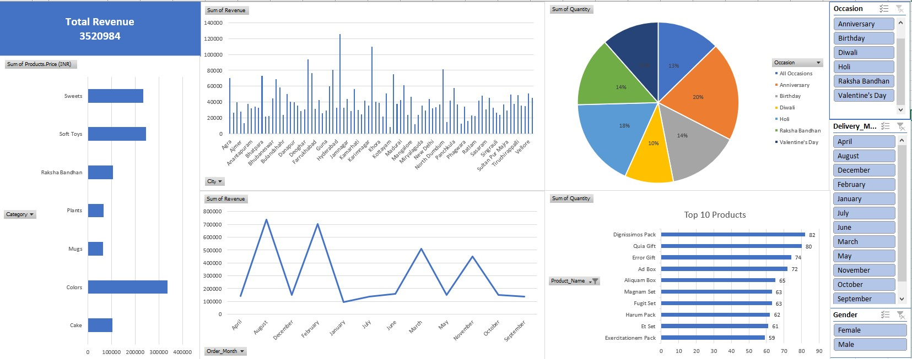

# 📊 Sales Dashboard – Excel Project

### 🖼️ Dashboard Preview:

---

### 🎯 Objective:
Analyze monthly and regional sales data to track revenue and profit performance.

### 📈 Tools Used:
- Microsoft Excel
  - Pivot Tables
  - Charts
  - Power Query
  - Data Validation

### 📌 Key Insights:
- Highest sales from Region X in Q2
- Category Y underperformed in August

### 🧮 Skills Demonstrated:
- Data cleaning
- Dashboard design
- Data visualization
